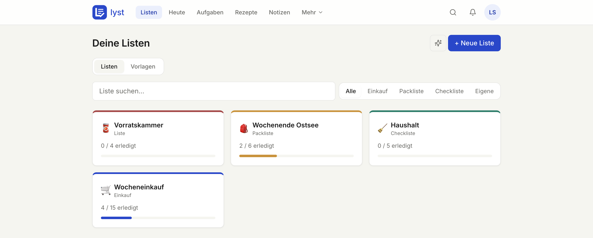
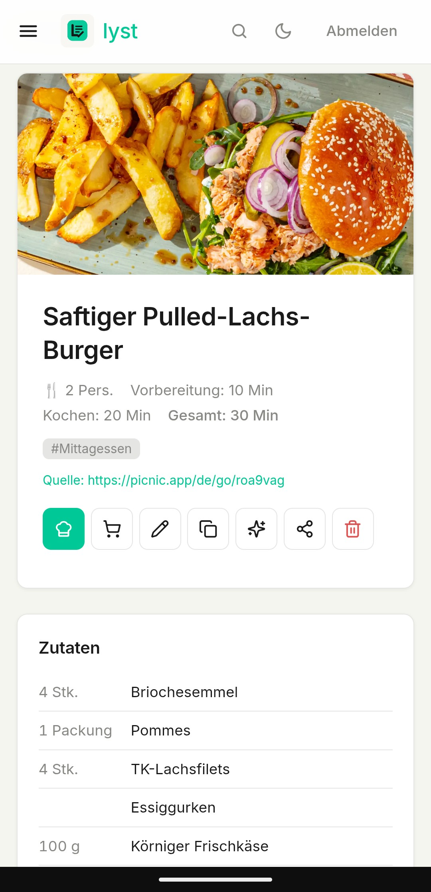
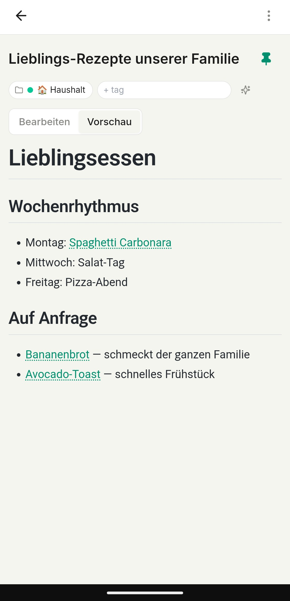
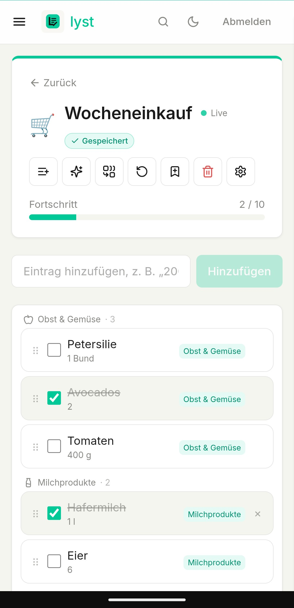

<div align="center">


# Lyst

**Self-hosted lists, notes & recipes with optional AI**

[](./LICENSE)
[](./docker-compose.yml)
[](https://github.com/laarsv/Lyst)
[](https://github.com/laarsv/Lyst/commits/main)

<p>
  
  
  
  
</p>

</div>

---

## What is Lyst?

Lyst is a small, self-hostable web app that combines shopping lists,
packing/checklist templates, markdown notes, and a recipe manager with
optional local-AI features powered by Ollama. It's PWA-installable, works
offline, and supports multiple users with admin controls — designed for a
household or small group running on a Mini PC, NAS, or any cheap VPS.

## Features

**Listen**
- Einkaufslisten · Packlisten · Checklisten · individuelle Listen
- Vorlagen, Massen-Hinzufügen ("200g Käse" wird automatisch zerlegt)
- Echtzeit-Sync zwischen mehreren Geräten via WebSocket
- Öffentliche Read-only-Links mit QR-Code, Mitnutzer mit Lese-/Bearbeitungsrechten
- Drag-and-drop Sortierung, manuelle / automatische Kategorisierung

**Rezepte**
- Import per URL oder Foto via lokales Ollama (oder Anthropic)
- Skalierung der Portionen, Cook-Mode (bildschirmfüllende Schritt-Ansicht)
- Nährwerte pro Portion, Zutaten direkt auf eine Liste übertragen
- Wochenplan mit Ein-Klick-Einkaufsliste

**Notizen**
- Markdown-Editor mit Live-Vorschau, Code-Blöcken, Tabellen, Aufgabenlisten
- Ordner, Tags, Verlinkung anderer Notizen via `[[Titel]]`-Wikilinks
- Versionsverlauf mit Wiederherstellung
- Vollwertige mobile Ansicht im Stil von Google Keep

**KI (optional)**
- Lokales Ollama für Item-Kategorisierung, Rezept-Import und "Was kann ich kochen?"
- Anthropic Claude als Cloud-Alternative
- Modelle bleiben dank `keep_alive` permanent im RAM → sofortige Antworten

**Mehr**
- Installierbar als PWA (Desktop + iOS + Android)
- Offline-Schreiben mit IndexedDB-Queue, Auto-Sync sobald online
- Dark Mode, deutschsprachige UI durchgängig
- Mehrbenutzer mit Admin-Bereich, JWT-Auth, Einladungen per E-Mail

## Tech stack

| Layer    | Stack |
|----------|-------|
| Backend  | FastAPI · async SQLAlchemy 2.0 · Alembic · APScheduler |
| Database | PostgreSQL 16 |
| Frontend | React 18 · TypeScript · Vite · Tailwind · Zustand · dnd-kit |
| AI       | Ollama (local) · optional Anthropic Claude (cloud) |
| Email    | Resend (optional — graceful degradation when disabled) |
| Container| Docker · Docker Compose v2 · multi-arch (amd64 + arm64) |

## Quick Start

```bash
# 1. Clone
git clone https://github.com/laarsv/Lyst.git
cd Lyst

# 2. Configure
cp .env.example .env
# Edit .env — at minimum set:
#   POSTGRES_PASSWORD, SECRET_KEY (openssl rand -hex 32),
#   INITIAL_ADMIN_EMAIL, INITIAL_ADMIN_PASSWORD,
#   FRONTEND_URL, BACKEND_CORS_ORIGINS

# 3. Run
docker compose up -d
```

Open <http://localhost:8091> and log in with the admin credentials you
just set. Migrations and the initial admin user are seeded automatically
on first start. For HTTPS, reverse-proxy setups, and backups see
[docs/INSTALLATION.md](docs/INSTALLATION.md).

## Configuration

Every setting is an environment variable in `.env`. The most important:

- `POSTGRES_PASSWORD`, `SECRET_KEY`, `INITIAL_ADMIN_*` — required.
- `FRONTEND_URL`, `BACKEND_CORS_ORIGINS` — must point at the public URL
  users see.
- `OLLAMA_*`, `RESEND_*`, `ANTHROPIC_*` — optional feature areas.

Full reference with defaults and example scenarios:
**[docs/CONFIGURATION.md](docs/CONFIGURATION.md)**.

## Optional: Ollama for AI features

Lyst can use a local Ollama instance for shopping-item categorisation,
recipe URL/photo import, and "was kann ich kochen?" suggestions. Without
Ollama, those features return a polite error and the rest of the app keeps
working. See **[docs/OLLAMA.md](docs/OLLAMA.md)** for setup options
(BYO Ollama vs Ollama in the same compose stack), model recommendations,
and hardware notes.

## Optional: Resend for emails

Lyst uses [Resend](https://resend.com) to send invitations, password
resets, and reminders. Leave the API key empty to disable mail entirely —
the affected flows print their links to the backend log instead, so the
app still works air-gapped. See **[docs/EMAIL.md](docs/EMAIL.md)** for
setup, domain verification, and how to swap Resend for another provider.

## Screenshots

<p align="center">
  
</p>
<p align="center">
  
</p>
<p align="center">
  
</p>
<p align="center">
  
</p>

## Contributing

Bug reports, feature ideas, and pull requests are very welcome. See
**[CONTRIBUTING.md](./CONTRIBUTING.md)** for issue templates, branch
conventions, code style, and the dev-environment guide
([docs/DEVELOPMENT.md](docs/DEVELOPMENT.md)). All contributors are
expected to follow the [Code of Conduct](./CODE_OF_CONDUCT.md).

## License

Lyst is licensed under the **GNU Affero General Public License v3.0**
(AGPL-3.0). Full text in [`LICENSE`](./LICENSE) — if the file is missing,
fetch it from <https://www.gnu.org/licenses/agpl-3.0.txt>.

In short: free to use, modify, and redistribute, including commercially —
but if you run a modified version as a network service, you must make the
source of that modified version available to its users.
